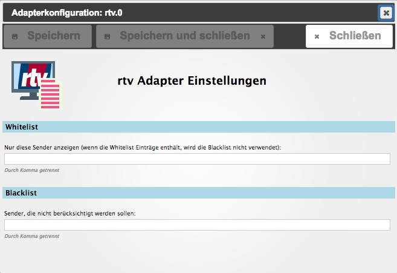
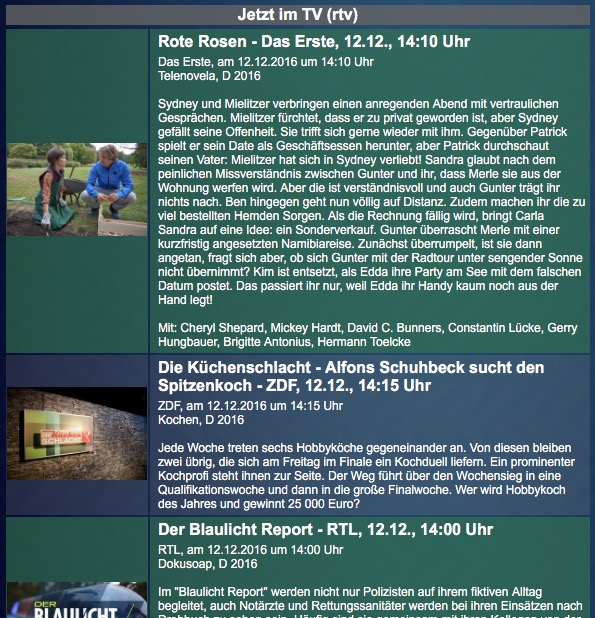

# ioBroker.rtv
=================

[](https://www.npmjs.com/package/iobroker.rtv)
[](https://www.npmjs.com/package/iobroker.rtv)

[](https://nodei.co/npm/iobroker.rtv/)

**Tests:** Linux/Mac: [](https://travis-ci.org/Pix---/ioBroker.rtv)
Windows: [](https://ci.appveyor.com/project/Pix---/ioBroker-rtv/)

## :de: rtv hat die Bereitstellung der Daten als XML ausgesetzt. Daher funktioniert der Adapter bis auf weiteres nicht.
## :en: rtv.de has cancelled providing the XML-Feed. There the adapter is not working for the time being.

## Beschreibung / Description
:de: Dieser Adapter liefert das TV Programm aus den RSS-Feeds "Tipps", "jetzt", "20:15 Uhr" und "22:00 Uhr" des deutschen Anbieters [rtv.de](http://www.rtv.de/statisch/rtv/rss-feeds.html). Die Daten werden in JSON Objekte gespeichert, um in [ioBroker.vis](https://github.com/ioBroker/ioBroker.vis) verarbeitet zu werden.

:uk: This adapter delivers a german tv program guide. The content ist captured from two rss feeds from supplier [rtv.de](http://www.rtv.de/statisch/rtv/rss-feeds.html) stored in JSON objects ready to use in [ioBroker.vis](https://github.com/ioBroker/ioBroker.vis)

## Einstellungen / Configuration
### Whitelist
Sollen nur Sendungen eines oder mehrerer bestimmter Sender angezeigt werden, sind diese Sendernamen in die Whitelist einzutragen. Enthält die Whitelist mindestens einen Eintrag, wird die Blacklist ignoriert.
Es ist möglich mehrere Sender mit dem Platzhalter "\*" (Stern) abzudecken: *\*RTL*, *RTL\** findet also "*SuperRTL*" und "*RTL II*"

To display only a specific list of stations add the stations names to the whitelist. The blacklist will be skipped if the whitelist is not empty.
Wildcards "\*" (star) can shorten the whitelist: *\*RTL*, *RTL\** returns "*SuperRTL*" und "*RTL II*"

### Blacklist
Sender, die nicht empfangbar sind oder nicht gelistet werden sollen, können in der Blacklist gespeichert und so bei der Ausgabe übersprungen werden. Die Blacklist wird nur berücksichtigt, wenn die Whitelist leer ist. Platzhalter können in der Blacklist bisher nicht verwendet werden.

TV channels that are not provided by your supplier or simply are not considered to be listed will be skipped. Therefore you can add them to the blacklist. The blacklist function is supported only when the whitelist is empty. The use of wildcards in the blacklist is not supported yet.



## Aktivierung / Schedule
Der Adapter startet alle 5min und liest die RSS-Feeds "Tipps", "heute um 20:15 Uhr", "heute um 22:00 Uhr" und "jetzt" ein.

The adapter starts every 5min to read the rss feeds "suggestions", "today at 0815pm", "today at 10pm" and "now".

##  Datenpunkte / Datapoints

rtv.0.json.__heute2015__  (*JSON* Tabelle für VIS Widget *json,table*)

rtv.0.json.__heute2200__  (*JSON* Tabelle für VIS Widget *json,table*)

rtv.0.json.__jetzt__  (*JSON* Tabelle für VIS Widget *json,table*)

rtv.0.json.__tipps__  (*JSON* Tabelle für VIS Widget *json,table*)


Beispiel / Example:
```
[{"image":"","text":"<table class=\"tv_jetzt\"><tr><td class=\"tv_jetzt_text\" style=\"text-align: left; padding-left: 5px; font-weight: bold\"><a href=\"http://www.rtv.de/sendungsdetails/11684447/ard-mittagsmagazin.html\" target=\"_blank\">ARD-Mittagsmagazin - Mit Tagesschau - Das Erste, 12.12., 13:00 Uhr</a></td></tr><tr><td style=\"text-align: left; padding-left: 5px\">Das Erste, am 12.12.2016 um 13:00 Uhr<br/>Magazin, D 2016<br/><br/>Nachrichten aus aller Welt, Neues aus Politik, Wirtschaft, Börse, Sport, Kultur und Service.</td></tr></table>","_Bild":""},{"image":"","text":"<table class=\"tv_jetzt\"><tr><td class=\"tv_jetzt_text\" style=\"text-align: left; padding-left: 5px; font-weight: bold\"><a href=\"http://www.rtv.de/sendungsdetails/11684415/ard-mittagsmagazin.html\" target=\"_blank\">ARD-Mittagsmagazin - Mit Tagesschau - ZDF, 12.12., 13:00 Uhr</a></td></tr><tr><td style=\"text-align: left; padding-left: 5px\">ZDF, am 12.12.2016 um 13:00 Uhr<br/>Magazin, D 2016<br/><br/>Nachrichten aus aller Welt, Neues aus Politik, Wirtschaft, Börse, Sport, Kultur und Service.</td></tr></table>","_Bild":""},{"image":"","text":"<table class=\"tv_jetzt\"><tr><td class=\"tv_jetzt_text\" style=\"text-align: left; padding-left: 5px; font-weight: bold\"><a href=\"http://www.rtv.de/sendungsdetails/11683235/punkt-12-das-rtl-mittagsjournal.html\" target=\"_blank\">Punkt 12 - Das RTL-Mittagsjournal - RTL, 12.12., 12:00 Uhr</a></td></tr><tr><td style=\"text-align: left; padding-left: 5px\">RTL, am 12.12.2016 um 12:00 Uhr<br/>Magazin, D 2016<br/><br/>Thementag - Wie sicher ist Deutschland: mit u.a. einem ausführlichen RTL-Trendbarometer zum Thema Sicherheit in Deutschland auf Basis aktueller Forsa-Ergebnisse. Reportage zu organisierten Einbrecherbanden aus Osteuropa. Dem P12-Reporter Torsten Misler ist es gelungen, mit einem Insider (ehemaliges Bandenmitglied) zu sprechen. Die Reportage zeigt auf, wie professionell die Banden in Deutschland operieren. Thema 'Kleiner Waffenschein'. Die Neuanmeldungen für den sogenannten kleinen Waffenschein sind nach den Silvesterereignissen von Köln massiv angestiegen. P12 erzählt die Geschichte über eine Familie, die den kleinen Waffenschein beantragt hat, und geht der Frage nach, ob er eine Hilfe ist und was man damit darf.</td></tr></table>","_Bild":""},{"image":"","text":"<table class=\"tv_jetzt\"><tr><td class=\"tv_jetzt_text\" style=\"text-align: left; padding-left: 5px; font-weight: bold\"><a href=\"http://www.rtv.de/sendungsdetails/11683440/richter-alexander-hold.html\" target=\"_blank\">Richter Alexander Hold - Sat.1, 12.12., 13:00 Uhr</a></td></tr><tr><td style=\"text-align: left; padding-left: 5px\">Sat.1, am 12.12.2016 um 13:00 Uhr<br/>Gerichtsserie, D 2012<br/><br/>Jürgen Aulehner wird seit Jahren von seinem Schwiegervater gedemütigt. Wollte er ihn deshalb auf der Jagd erschießen?</td></tr></table>","_Bild":""},{"image":"","text":"<table class=\"tv_jetzt\"><tr><td class=\"tv_jetzt_text\" style=\"text-align: left; padding-left: 5px; font-weight: bold\"><a href=\"http://www.rtv.de/sendungsdetails/11684252/how-i-met-your-mother.html\" target=\"_blank\">How I Met Your Mother - Zehn Sitzungen - ProSieben, 12.12., 12:50 Uhr</a></td></tr><tr><td style=\"text-align: left; padding-left: 5px\">ProSieben, am 12.12.2016 um 12:50 Uhr<br/>Comedyserie, USA 2008<br/><br/>Ted ist immer noch verschossen in seine Hautärztin Stella und bittet sie unermüdlich um ein Date. Während sich die Arzthelferin Abby sofort in Ted verliebt hat, weist ihn Stella weiterhin ab. Nach der letzten Sitzung erfährt er auch den Grund - Stella hat eine kleine Tochter und das mit den Dates gestaltet sich dadurch schwieriger als gedacht. Doch Ted lässt sich einiges einfallen ... Und Barney versucht alles, um die schöne Abby auf sich aufmerksam zu machen.<br/><br/>Mit: Josh Radnor, Jason Segel, Cobie Smulders, Neil Patrick Harris, Alyson Hannigan, Sarah Chalke, Britney Spears</td></tr></table>","_Bild":""},{"image":"","text":"<table class=\"tv_jetzt\"><tr><td class=\"tv_jetzt_text\" style=\"text-align: left; padding-left: 5px; font-weight: bold\"><a href=\"http://www.rtv.de/sendungsdetails/11683715/cold-case-kein-opfer-ist-je-vergessen.html\" target=\"_blank\">Cold Case - Kein Opfer ist je vergessen - Hexenjagd - kabel eins, 12.12., 13:00 Uhr</a></td></tr><tr><td style=\"text-align: left; padding-left: 5px\">kabel eins, am 12.12.2016 um 13:00 Uhr<br/>Krimiserie, USA 2004, FSK: 16<br/><br/>Als Howard Lang erfährt, dass sein Vater 1953 brutal ermordet wurde, wendet er sich an Lilly Rush und ihr Team. Die Akte wird nochmals geöffnet, und bei den Untersuchungen finden die Detectives heraus, dass das Opfer wegen seiner Verbindungen zu einer angeblich kommunistischen Gruppe von der Regierung verfolgt wurde. Ob bei dieser allgemeinen Hexenjagd auf vermutete Kommunisten auch über Leichen gegangen wurde, will Detective Rush endgültig aufklären.<br/><br/>Mit: Kathryn Morris, Danny Pino, John Finn, Jeremy Ratchford, Thom Barry, Nicki Aycox, Josh Randall</td></tr></table>","_Bild":""},{"image":"","text":"<table class=\"tv_jetzt\"><tr><td class=\"tv_jetzt_text\" style=\"text-align: left; padding-left: 5px; font-weight: bold\"><a href=\"http://www.rtv.de/sendungsdetails/11684768/zib.html\" target=\"_blank\">ZIB - 3sat, 12.12., 13:00 Uhr</a></td></tr><tr><td style=\"text-align: left; padding-left: 5px\">3sat, am 12.12.2016 um 13:00 Uhr<br/>Nachrichten<br/><br/>Aktuelle Nachrichten aus Österreich und aller Welt im Überblick.</td></tr></table>","_Bild":""},{"image":"","text":"<table class=\"tv_jetzt\"><tr><td class=\"tv_jetzt_text\" style=\"text-align: left; padding-left: 5px; font-weight: bold\"><a href=\"http://www.rtv.de/sendungsdetails/11685987/.html\" target=\"_blank\">360° Geo Reportage - Mezcal, Hochprozentiges aus Mexiko - ARTE, 12.12., 12:35 Uhr</a></td></tr><tr><td style=\"text-align: left; padding-left: 5px\">ARTE, am 12.12.2016 um 12:35 Uhr<br/>Reportage, D 2012<br/><br/>Schon die Ureinwohner der mexikanischen Region Oaxaca, die Zapoteken, brauten für ihre Riten einen Likör aus wilden Agaven und Heilpflanzen den Mezcal. Noch heute wird der traditionelle Mezcal vor allem in Familienbetrieben gebrannt. Die verschiedenen Agavenarten aus der Provinz Oaxaca geben ihm seinen besonderen Geschmack. Mezcalero zu sein, also Mezcal-Meister, gilt hier als angesehener Beruf, viele Familien haben ihre Existenz auf den Anbau und die Verarbeitung der Agaven ausgerichtet. Doch immer mehr große Firmen wollen ihren Anteil am Geschäft mit dem populären Getränk, und die kleinen Destillen müssen um ihren Platz auf dem heiß umkämpften Markt ringen. \"360° Geo Reportage\" hat eine Mezcalero-Familie besucht. Tausende von Agaven säumen die Felder im mexikanischen Oaxaca, jede einzelne über einen Meter hoch und gespickt mit speerspitzenartigen Blättern. Die Ernte ist Knochenarbeit. Auf den Feldern von Don Felipe ist die Arbeit in vollem Gange. Die geernteten Agavenherzen werden gekocht, zerkleinert und vergoren. Dann beginnt die eigentliche Kunst des Mescaleros: die Destillerie, die dem Mezcal seinen typischen Geschmack gibt. Über 50 verschiedene Sorten gibt es. Am bekanntesten ist der Tequila. Der traditionelle Mezcal wird hauptsächlich in der Region Oaxaca hergestellt. Hier leben viele Familien von der Mezcal-Produktion. Die Mezcaleros geben ihre Rezepte an die nachfolgende Generation weiter. Einer von ihnen ist Don Felipe, dessen Familie bereits seit Generationen Agaven anbaut und verarbeitet bisher allerdings nur für den Eigenbedarf und für ausgewählte Kunden, die persönlich beliefert werden. Doch leben kann die Familie davon nicht. Deshalb möchte Don Felipe, so wie viele Mezcal-Bauern, sein Geschäft profitabler machen, bevor die internationalen Firmen, die längst das Potenzial des immer beliebter werdenden Agaven-Schnapses erkannt haben, den Markt völlig unter sich aufgeteilt haben. Mezcal gehört bereits zu den wichtigsten Wirtschaftszweigen der verarmten Region. Um ihr Produkt offiziell verkaufen zu dürfen, benötigen Mezcaleros wie Don Felipe jedoch eine offizielle Registrierung. Und die muss er erst beantragen. Hilfe bekommt er von Silvia Philion, die eine der ersten Mezcalotheken der Region betreibt. Sie hält Don Felipes Mezcal für einen der besten seiner Art. Nun müssen nur noch die Behörden überzeugt werden.</td></tr></table>","_Bild":""},{"image":"","text":"<table class=\"tv_jetzt\"><tr><td class=\"tv_jetzt_text\" style=\"text-align: left; padding-left: 5px; font-weight: bold\"><a href=\"http://www.rtv.de/sendungsdetails/11683294/.html\" target=\"_blank\">Zwischen Tüll und Tränen - VOX, 12.12., 13:00 Uhr</a></td></tr><tr><td style=\"text-align: left; padding-left: 5px\">VOX, am 12.12.2016 um 13:00 Uhr<br/>Dokusoap, D 2016<br/><br/>Wenn das ersehnte Hochzeitsdatum feststeht, ist bei Bräuten in spe das Herzklopfen groß und die To-Do-Liste besonders lang. Ein Punkt steht dabei bei allen ganz vorn auf der Agenda: das perfekte Brautkleid. Doch was ist der richtige Schnitt für die Figur? Welche Farbe schmeichelt dem Teint und welches Traummodell passt überhaupt ins Budget? Schnell stellt sich bei den angehenden Bräuten Überforderung ein, doch die Brautmodenausstatter der Doku-Soap \"Zwischen Tüll und Tränen\" bewahren bei allen Kundenwünschen einen kühlen Kopf! Die passionierten Brautprofis leben ihren Traumberuf: Ob im Hochzeitsmoden-Discounter, in exklusiven Nobel-Boutiquen oder Nischen-Brautläden - mit der richtigen Prise Einfühlungsvermögen und einem geschulten Blick finden sie für jedes Brautkleid-Problem eine Lösung. Einzig die Entourage der Kundinnen stellt sie manchmal auf die Probe: Wenn nicht nur die zukünftige Braut sondern auch die beste Freundin, Trauzeugin, Mutter oder Schwiegermutter eigene Vorstellungen vom Hochzeitskleid haben, sind besonders starke Nerven gefragt.</td></tr></table>","_Bild":""},{"image":"","text":"<table class=\"tv_jetzt\"><tr><td class=\"tv_jetzt_text\" style=\"text-align: left; padding-left: 5px; font-weight: bold\"><a href=\"http://www.rtv.de/sendungsdetails/11683960/tom-und-jerry.html\" target=\"_blank\">Tom und Jerry - Tom angelt sich Ärger / Tom kriegt einen Stellvertreter / Tom als Wühlmaus / Spielchen mit Tom - Super RTL, 12.12., 13:00 Uhr</a></td></tr><tr><td style=\"text-align: left; padding-left: 5px\">Super RTL, am 12.12.2016 um 13:00 Uhr<br/>Trickserie, USA 1941-1958, FSK: 6<br/><br/>1. Geschichte: Tom hat eine neue Leidenschaft, das Angeln. Doch der Spaß findet ein jähes Ende als er plötzlich Jerry am Haken hat. 2. Geschichte: Als es an der Tür klingelt und der Postbote ein Paket vorbeibringt ist Tom ganz gespannt was sich darin wohl befinden mag. Doch als ein kleines Kätzchen zum Vorschein kommt ist die Enttäuschung groß. Auf Konkurrenz hat Tom keine Lust. 3. Geschichte: Es scheint als habe Tom Probleme mit seinem Gedächtnis. Obwohl es ihm noch nie gelungen ist Jerry zu fangen, versucht er es immer und immer wieder. Dabei stößt er auch dieses Mal an seine Grenzen. 4. Geschichte: Tom und Jerry liefern sich heute eine gefährliche Verfolgungsjagd hoch über den Dächern der Stadt. Als sich auch noch ein Straßenkater und eine Bulldogge in das Geschehen einmischen, droht die Situation zu eskalieren.</td></tr></table>","_Bild":""},{"image":"","text":"<table class=\"tv_jetzt\"><tr><td class=\"tv_jetzt_text\" style=\"text-align: left; padding-left: 5px; font-weight: bold\"><a href=\"http://www.rtv.de/sendungsdetails/11684728/die-fantastische-welt-von-gumball.html\" target=\"_blank\">Die fantastische Welt von Gumball - Die Prokrastinierer / Die Schale - KI.KA, 12.12., 12:55 Uhr</a></td></tr><tr><td style=\"text-align: left; padding-left: 5px\">KI.KA, am 12.12.2016 um 12:55 Uhr<br/>Trickserie, USA, IRL, D, GB 2011<br/><br/>Die Prokrastinierer: Gumball und Darwin sind entsetzt, weil ihre Mutter ihnen vorwirft, immer alles aufzuschieben. Als die beiden den Müll vor die Tür tragen sollen, wird aber schnell klar, dass Nicoles Diagnose nicht allzu abwegig ist. Die Schale: Bei einer Schulaufführung, bei der Gumball Penny vor aller Augen küssen soll, ist der verliebte Schüler so nervös, dass er aus Versehen Pennys Schale aufbricht. Au Backe!</td></tr></table>","_Bild":""},{"image":"","text":"<table class=\"tv_jetzt\"><tr><td class=\"tv_jetzt_text\" style=\"text-align: left; padding-left: 5px; font-weight: bold\"><a href=\"http://www.rtv.de/sendungsdetails/11683590/yo-kai-watch.html\" target=\"_blank\">Yo-Kai Watch! - Ein seltenes Exemplar / Yo-kai Möter / Yo-kai Rebelzebub / Möter (2) - Nick, 12.12., 13:10 Uhr</a></td></tr><tr><td style=\"text-align: left; padding-left: 5px\">Nick, am 12.12.2016 um 13:10 Uhr<br/>Trickserie, J, USA 2015, FSK: 6<br/><br/>\"Ein seltenes Exemplar\" Nathan ist sich sicher, dass sich der Yo-kai Noko in seinem Zimmer aufhält, aber Whisper beharrt darauf, dass Noko nur eine Legende ist. \"Yo-kai Möter\" Die erschreckenden Berichte über einen \"Hund mit Menschengesicht\" führen dazu, dass Nathan und Whisper auf Möter treffen, ein besonders unglücklicher Yo-kai, der seine Geschichte erzählen möchte. \"Yo-kai Rebelzebub\" Als der fleißige Freddy plötzlich durch schlechtes Benehmen auffällt, erkennt Nathan, dass der Yo-kai Rebelzebub dahinter steckt und ruft seine Freunde zur Hilfe. \"Möter: Teil 2\" Möters grobes Verhalten bringt ihn ins Gefängnis, wo er sich nach einem zweiten Leben und einer neuen Aufgabe sehnt.</td></tr></table>","_Bild":""},{"image":"","text":"<table class=\"tv_jetzt\"><tr><td class=\"tv_jetzt_text\" style=\"text-align: left; padding-left: 5px; font-weight: bold\"><a href=\"http://www.rtv.de/sendungsdetails/11683183/.html\" target=\"_blank\">Köln 50667 - RTL II, 12.12., 12:55 Uhr</a></td></tr><tr><td style=\"text-align: left; padding-left: 5px\">RTL II, am 12.12.2016 um 12:55 Uhr<br/>Dokusoap, D 2016<br/><br/>Alex sieht ein, dass er keine andere Wahl hat, als die Polizei einzuschalten, um Elli nicht zu gefährden und sie aus Brunos Gewalt zu befreien. In seiner Überforderung gerät Alex aber auch noch mit dem leitenden Kommissar in Streit. Jan ist fest entschlossen heute seinen Heiratsantrag zu proben und nimmt dafür sogar einen Streit mit Holly in Kauf. Als Jan seinen viel zu großen Anzug vom Schneider bekommt, befürchtet er, dass das nur das erste von vielen Problemen sein wird - und er soll recht behalten.</td></tr></table>","_Bild":""},{"image":"","text":"<table class=\"tv_jetzt\"><tr><td class=\"tv_jetzt_text\" style=\"text-align: left; padding-left: 5px; font-weight: bold\"><a href=\"http://www.rtv.de/sendungsdetails/11683205/dauerwerbesendung.html\" target=\"_blank\">Dauerwerbesendung - Tele 5, 12.12., 07:54 Uhr</a></td></tr><tr><td style=\"text-align: left; padding-left: 5px\">Tele 5, am 12.12.2016 um 07:54 Uhr<br/>Nachrichten</td></tr></table>","_Bild":"no image"},{"image":"","text":"<table class=\"tv_jetzt\"><tr><td class=\"tv_jetzt_text\" style=\"text-align: left; padding-left: 5px; font-weight: bold\"><a href=\"http://www.rtv.de/sendungsdetails/11683160/.html\" target=\"_blank\">Fußball - Europa League - Eurosport, 12.12., 13:00 Uhr</a></td></tr><tr><td style=\"text-align: left; padding-left: 5px\">Eurosport, am 12.12.2016 um 13:00 Uhr<br/>Fußball</td></tr></table>","_Bild":""},{"image":"","text":"<table class=\"tv_jetzt\"><tr><td class=\"tv_jetzt_text\" style=\"text-align: left; padding-left: 5px; font-weight: bold\"><a href=\"http://www.rtv.de/sendungsdetails/11682979/teleshopping.html\" target=\"_blank\">Teleshopping - Sport1, 12.12., 12:30 Uhr</a></td></tr><tr><td style=\"text-align: left; padding-left: 5px\">Sport1, am 12.12.2016 um 12:30 Uhr<br/>Sonstiges</td></tr></table>","_Bild":"no image"},{"image":"","text":"<table class=\"tv_jetzt\"><tr><td class=\"tv_jetzt_text\" style=\"text-align: left; padding-left: 5px; font-weight: bold\"><a href=\"http://www.rtv.de/sendungsdetails/11683355/elefant-tiger-a-co.html\" target=\"_blank\">Elefant, Tiger & Co. - Geschichten aus dem Leipziger Zoo - SWR, 12.12., 12:25 Uhr</a></td></tr><tr><td style=\"text-align: left; padding-left: 5px\">SWR, am 12.12.2016 um 12:25 Uhr<br/>Reportage, D 2014<br/><br/>Kampf um die Höhle! Hummer Florian - seit einiger Zeit im Nordseebecken. Er hat sich gut eingelebt, eine tolle Höhle gefunden und fühlt sich dort wohl. Doch jetzt das: Muräne Helene soll zukünftig auch im Becken wohnen und sie will seine Höhle haben - versucht ihn heraus zu drängen! Aber sie hat nicht mit Florian gerechnet. Mit allen Scheren verteidigt er sein Reich! Ob das gut geht? Amurleoparden: Liebe auf den ersten Blick Tierpfleger Lasse Nieberding arbeitet erst seit Kurzen in seinem neuen Revier bei den Amurleoparden - und schon hat es zwischen ihm und den Tieren gefunkt! Besonders Leopardendame Vatne hat es Lasse angetan; in jeder freien Minute schaut er nach der Raubkatze, die ihr neues, großes Zuhause sichtlich genießt. Weil ihr Käfig hinter den Kulissen aber nicht so attraktiv ist wie das aufwändig gestaltete Außengehege, will Lasse der Leopardin etwas Abwechslung bieten und hat mit einem täglichen Training begonnen. Schon nach wenigen Unterrichtsstunden ist klar: Vatne ist ein Naturtalent und Lasse ganz aus dem Häuschen. Ist dies der Beginn einer wunderbaren Freundschaft? Großer Ausflug! Jamal, der kleine Giraffenbulle, soll alle anderen Bewohner der Afrikasavanne kennenlernen: Zebras, Antilopen, Strauße und Co. Das Problem: Jamal ist sehr, sehr neugierig, deshalb hat Marco Mehner noch so seine Bedenken. Nicht das Jamal einfach so drauflos prescht und dann von den Zebras gejagt wird. Die Doku-Serie erzählt Geschichten von Menschen und Tieren aus dem Zoo Leipzig, beleuchtet den Alltag hinter den Kulissen eines der renommiertesten Zoologischen Gärten Europas.</td></tr></table>","_Bild":""},{"image":"","text":"<table class=\"tv_jetzt\"><tr><td class=\"tv_jetzt_text\" style=\"text-align: left; padding-left: 5px; font-weight: bold\"><a href=\"http://www.rtv.de/sendungsdetails/11684556/carl-a-bertha.html\" target=\"_blank\">Carl & Bertha - BR Fernsehen, 12.12., 12:00 Uhr</a></td></tr><tr><td style=\"text-align: left; padding-left: 5px\">BR Fernsehen, am 12.12.2016 um 12:00 Uhr<br/>Historienfilm, D 2011, FSK: 6<br/><br/>Mit der ersten, kühnen Fahrt im pferdelosen Wagen schrieb Bertha Benz sich in die Technikgeschichte ein und verschaffte der Erfindung ihres Mannes Carl den Durchbruch. Nach Motiven aus dem Leben des Ehepaares Benz erzählt \"Carl & Bertha\" eine Geschichte von unerschütterlichem Vertrauen, von Zuversicht und großer Liebe. Die junge Bertha Ringer verliebt sich in Carl Benz und seine visionären Ideen und erkämpft sich die Ehe mit dem verschuldeten Ingenieur. Carls Traum vom pferdelosen Wagen braucht nicht nur technisches Knowhow, sondern auch sehr viel Zeit, mühsam zu findende Investoren und noch mehr Überzeugungskraft. Nach harten Jahren für das Ehepaar gelingt es ihm, seinen Verbrennungsmotor zu einem Motorwagen weiterzuentwickeln. Als den niemand haben will, ist Carl nahe dran, aufzugeben. Spontan macht Bertha sich mit ihren Söhnen auf eine Pionierfahrt, um die Fahrtüchtigkeit des Wagens zu beweisen.<br/><br/>Mit: Felicitas Woll, Ken Duken, Hansjürgen Hürrig, Michou Friesz, Alexander Beyer, Jürgen Schornagel, Johann von Bülow</td></tr></table>","_Bild":""},{"image":"","text":"<table class=\"tv_jetzt\"><tr><td class=\"tv_jetzt_text\" style=\"text-align: left; padding-left: 5px; font-weight: bold\"><a href=\"http://www.rtv.de/sendungsdetails/11683541/planet-wissen.html\" target=\"_blank\">Planet Wissen - Black Box EU? - Fakten statt Mythen - WDR, 12.12., 13:00 Uhr</a></td></tr><tr><td style=\"text-align: left; padding-left: 5px\">WDR, am 12.12.2016 um 13:00 Uhr<br/>Magazin, D 2016<br/><br/>Einfache Lösungen sind in der Politik die Ausnahme. So fällt es oft schon schwer, die politischen Entscheidungen innerhalb der Bundesrepublik nachzuvollziehen. Noch undurchsichtiger wird es innerhalb einer Staatengemeinschaft wie der Europäischen Union (EU). Für viele von uns ist die EU daher eine Black Box. Und damit Nährboden für Vorurteile und Mythen: Dieser Beamtenapparat in Brüssel verbietet krumme Gurken und Glühbirnen - unglaublich! Die entscheiden hinter verschlossenen Türen! Und wir zahlen die Rechnung - wie immer! Gemeinsam mit Rolf-Dieter Krause, der viele Jahre das ARD-Studio in Brüssel leitete, wollen wir hinter die Kulissen der EU schauen: Was ist wirklich dran an den Vorurteilen? Wie wichtig ist die EU für uns? Was läuft schief und was muss sich ändern? In Zeiten, in denen Rechtspopulisten nationalstaatlich-völkisches Denken wieder salonfähig machen, wollen wir erinnern, was die Menschen nach zwei Weltkriegen dazu veranlasste, eine Zusammenarbeit auf europäischer Ebene anzugehen.</td></tr></table>","_Bild":""},{"image":"","text":"<table class=\"tv_jetzt\"><tr><td class=\"tv_jetzt_text\" style=\"text-align: left; padding-left: 5px; font-weight: bold\"><a href=\"http://www.rtv.de/sendungsdetails/11684210/.html\" target=\"_blank\">Weihnachten für Einsteiger - MDR, 12.12., 12:30 Uhr</a></td></tr><tr><td style=\"text-align: left; padding-left: 5px\">MDR, am 12.12.2016 um 12:30 Uhr<br/>Komödie, D 2014, FSK: 6<br/><br/>Sie ist hübsch, clever, weltgewandt - und eine Betrügerin: Die junge Katharina verfolgt nur ein Ziel, wenn sie wohlhabende ältere Männer umgarnt: sie nach Strich und Faden auszunehmen. Ihr Partner Rocko kümmert sich im Hintergrund um das Organisatorische. Auch ihrem neuesten Opfer, einem steinreichen Russen, kann sie spielend einen Koffer voll Geld entwenden. Aber dummerweise wird Katharina die Handlanger des Oligarchen nicht los. Im Zug greift sie zu einem Trick, um die Verfolger zu täuschen: Sie schnappt sich einen unbekannten Mitreisenden und drückt ihm ohne Vorwarnung einen innigen Kuss auf die Lippen. Als Pärchen getarnt, kann sie mit ihrer neuen Bekanntschaft Matthias unbehelligt in Monschau aussteigen. Das Problem ist nur: Aus dem idyllischen Ort fährt kein Zug mehr zurück, den Geldkoffer hat sie auf der Flucht verloren und in ihrem Portemonnaie herrscht Ebbe. Da Matthias mit seinem jüngeren Bruder Kalle eine kleine Manufaktur für Daunenbetten betreibt, will sie kurzerhand den Firmentresor ausräumen, bevor sie zu Rocko verschwindet. Die Sache hat nur einen Haken: In dem Geldschrank herrscht gähnende Leere, denn der Betrieb steht kurz vor der Pleite. Also muss Katharina dafür sorgen, dass Matthias und Kalle erst einmal einen dicken Auftrag an Land ziehen. Kurzerhand setzt sie ihre oft erprobte Überzeugungskunst bei der Chefin eines Nobelhotels ein, die nach einem Lieferanten für Daunendecken sucht. Die findet aber vor allem Gefallen an dem gut aussehenden Kalle. Katharina spürt derweil, dass ihre stärker werdenden Gefühle für Matthias ihren diebischen Absichten in die Quere kommen - anstatt ihn zu bestehlen, würde sie am liebsten bei ihm bleiben. Dann aber taucht nicht nur der ungeduldige Rocko in Monschau auf, sondern auch ihre russischen Verfolger. Eine Betrügerin, die ihre Talente für einen guten Zweck einsetzt und ein Brüderpaar, das trotz aller Zwistigkeiten zusammenhalten muss, stehen im Mittelpunkt dieser originellen Komödie. Hauptdarstellerin Anna Fischer sah man zuletzt in den romantischen Tragikomödien \"Heiter bis wolkig\" und \"Besser als nix\" auf der Kinoleinwand. Regisseur Sven Bohse war für seinen Film \"Das Maß der Dinge\" für den Studenten-Oscar nominiert.<br/><br/>Mit: Anna Fischer, Oliver Wnuk, Patrick Mölleken, Sonja Gerhardt, Barnaby Metschurat, Susanna Simon, Irene Rindje</td></tr></table>","_Bild":""},{"image":"","text":"<table class=\"tv_jetzt\"><tr><td class=\"tv_jetzt_text\" style=\"text-align: left; padding-left: 5px; font-weight: bold\"><a href=\"http://www.rtv.de/sendungsdetails/11683751/schloss-einstein.html\" target=\"_blank\">Schloss Einstein - RBB, 12.12., 13:05 Uhr</a></td></tr><tr><td style=\"text-align: left; padding-left: 5px\">RBB, am 12.12.2016 um 13:05 Uhr<br/>Jugendserie, D 2012<br/><br/>Nervös erwartet Feli ihr Praktikum in der Kfz-Werkstatt. Wird ihre Verkleidung als \"Felix\" zwei Wochen überzeugen können? Der Arbeitsalltag konfrontiert sie mit kleinen und großen Schwierigkeiten, die das \"Mannsein\" mit sich bringt. Dabei steht sie bald vor weit größeren Problemen. Zufällig wird sie Zeugin, wie ihr Chef gelieferte Markenbremsscheiben gegen No-Name-Produkte austauscht. Für Bruno ist klar: Der Mann betrügt, und Feli muss etwas dagegen unternehmen. Zwar konnte Hubertus die Malerleiter erfolgreich manipulieren, doch statt Tobias erwischt es erneut Herrn Pasulke. Die Bogenschießmeisterschaft rückt immer näher, und Tobias ist partout nicht von der Teilnahme abzuhalten. Hubertus entwickelt einen letzten verzweifelten Plan. Er muss Tobias im Keller, den er streichen soll, einsperren. Der Testlauf funktioniert hervorragend - bis sich Hubertus auf der falschen Türseite wiederfindet. Hinter verschlossenen Türen muss er seine Niederlage eingestehen. Pippi und Jonny finden mitten in der Stadt ein Pony. Zunächst wundern sich die beiden, bis der Halter auftaucht und zu verstehen gibt, dass er Geld erbettelt. Dafür also das arme Pony - lukrativer Mitleidsbonus. Als der Halter sich den gesamten nächsten Tag nicht blicken lässt, fackeln Jonny und Pippi nicht lang: Um das Tier zu retten, entführen sie es. Werden sie damit durchkommen?</td></tr></table>","_Bild":""},{"image":"","text":"<table class=\"tv_jetzt\"><tr><td class=\"tv_jetzt_text\" style=\"text-align: left; padding-left: 5px; font-weight: bold\"><a href=\"http://www.rtv.de/sendungsdetails/11684870/.html\" target=\"_blank\">Wohin der Weg mich führt - Hessen, 12.12., 13:00 Uhr</a></td></tr><tr><td style=\"text-align: left; padding-left: 5px\">Hessen, am 12.12.2016 um 13:00 Uhr<br/>Familienfilm, D 2012, FSK: 6<br/><br/>Die Rechtsanwältin Sarah Stein hat ihr Leben fest im Griff und für ihre Karriere ein klares Ziel vor Augen: Partnerin in der renommierten Frankfurter Kanzlei werden, für die sie arbeitet. Der neueste Fall, mit dem ihr Chef sie betraut, wirkt jedoch eher wie ein Anfängerjob: Der alte Pflegevater des Winzers Peter Jahn ist gestorben. Da es scheinbar kein Testament gibt, erhebt der leibliche Sohn Siggi als Alleinerbe sämtliche Ansprüche auf das Familienweingut. Und da Peter auf kein anwaltliches Schreiben reagiert hat, soll Sarah ihm nun höchstpersönlich die Kündigung überreichen. Die Sachlage scheint sonnenklar, Sarah stellt sich auf eine kurze Stippvisite in der Provinz ein. So einfach läuft die Sache dann aber nicht. Peter weiß genau, dass sein Ziehvater ihn als Erben des Guts vorgesehen hatte. Offenbar hat der eifersüchtige Siggi das Testament verschwinden lassen. Geht es nun nach Siggis Willen, sollen die uralten Weinberge einem noblen Wellnesshotel weichen. Doch auch Peter, selbst ein ehemaliger Anwalt, kennt seine Rechte: Als alleinerziehenden Vater von drei Pflegesöhnen würde ihn kein Richter vor die Tür setzen. Sarah hat keine Wahl: Während ihr defekter Sportwagen in der Werkstatt des schwer in sie verschossenen \"Torte\" Neumann verdächtig lange auf eine Reparatur wartet, sucht sie ein Druckmittel, um Peter zum Einlenken zu zwingen. Ein boshafter Streich seiner Pflegesöhne spielt ihr dabei in die Hände: Sarah will dem widerspenstigen Winzer das Sorgerecht für die Jungen entziehen lassen - ohne Kinder hätte er gegen eine Räumungsklage keine Chance mehr. Aber so abgebrüht und hartherzig die Anwältin sich gibt, so sehr muss sie sich insgeheim eingestehen, dass ihr juristischer Sparringspartner mit seiner eigenwilligen Art eine seltsame Faszination auf sie ausübt. Zugleich kommen ihr immer größere Zweifel, ob ihr Mandant Siggi wirklich ein ehrliches Spiel treibt. Erst, als es schon fast zu spät ist, erkennt die Karrierefrau, dass es nicht immer nur darum geht zu gewinnen, sondern manchmal ein offenes Wort mehr bewirken kann als alle Gesetzesbücher dieser Welt.<br/><br/>Mit: Johanna Christine Gehlen, Michael Fitz, Edda Leesch, Jochen Nickel, Uli Krohm, Thibault Sérié, Thilo Berndt</td></tr></table>","_Bild":""},{"image":"","text":"<table class=\"tv_jetzt\"><tr><td class=\"tv_jetzt_text\" style=\"text-align: left; padding-left: 5px; font-weight: bold\"><a href=\"http://www.rtv.de/sendungsdetails/11684630/.html\" target=\"_blank\">Tierärztin Dr. Mertens - Nachwuchssorgen - NDR, 12.12., 12:55 Uhr</a></td></tr><tr><td style=\"text-align: left; padding-left: 5px\">NDR, am 12.12.2016 um 12:55 Uhr<br/>Serien, D 2009<br/><br/>Tierärztin Dr. Susanne Mertens hat ihr Baby durch eine dramatische Fehlgeburt verloren und hofft nun auf eine erneute Schwangerschaft. Leider vergeblich. Bei einem Arztbesuch erhält sie den niederschmetternden Befund: Sie wird wahrscheinlich keine Kinder mehr bekommen können. Unterdessen will Susannes Mutter Charlotte Baumgart es noch einmal wissen: Sie hat sich, ungeachtet ihres Alters, an der Kunsthochschule beworben. Doch Gatte Georg hat kein Verständnis für ihre Pläne. Er weigert sich, den Wunsch seiner Frau, sich künstlerisch zu verwirklichen, zu akzeptieren. Auch bei Christophs Tochter Rebecca ändert sich einiges: Sie kommt mit ihren fast 13 Jahren gerade in die Pubertät und verliebt sich prompt bis über beide Ohren, allerdings in zwei Jungen gleichzeitig. Die Qual der Wahl hat auch Zoodirektor Dr. Fährmann: Susannes Assistentin Annett hat zum Monatsende gekündigt. Er muss unbedingt eine Nachfolgerin finden. Doch Fährmanns Favoritin entspricht so gar nicht dem Profil der ausgeschriebenen Stelle, denn Nicole Sommer ist ausgebildete Tierärztin und damit absolut überqualifiziert. Im Zoo erkrankt währenddessen ein Brillenpinguin an der gefährlichen und kaum heilbaren Krankheit Vogelmalaria. Da Pinguine sich die Brutpflege teilen, kann Susanne das erkrankte Pinguinweibchen isolieren. Das Junge wird fortan von seinem Vater aufgezogen. Doch dann erkrankt auch das Pinguinmännchen. Alle Versuche, den kleinen Pinguin von Hand aufzuziehen, scheitern. Sterben die Pinguineltern, hätte auch der kleine Nachwuchs keine Überlebenschancen.<br/><br/>Mit: Elisabeth Lanz, Sven Martinek, Michael Lesch, Ursela Monn, Gunter Schoß, Thorsten Wolf, Ludwig Zimmeck</td></tr></table>","_Bild":""},{"image":"","text":"<table class=\"tv_jetzt\"><tr><td class=\"tv_jetzt_text\" style=\"text-align: left; padding-left: 5px; font-weight: bold\"><a href=\"http://www.rtv.de/sendungsdetails/11687451/shop-24.html\" target=\"_blank\">Shop 24 - Infomercial - TV Berlin, 12.12., 13:00 Uhr</a></td></tr><tr><td style=\"text-align: left; padding-left: 5px\">TV Berlin, am 12.12.2016 um 13:00 Uhr<br/>Sonstiges, CH</td></tr></table>","_Bild":"no image"},{"image":"","text":"<table class=\"tv_jetzt\"><tr><td class=\"tv_jetzt_text\" style=\"text-align: left; padding-left: 5px; font-weight: bold\"><a href=\"http://www.rtv.de/sendungsdetails/11687541/sendepause.html\" target=\"_blank\">Sendepause - Spreekanal, 11.12., 22:00 Uhr</a></td></tr><tr><td style=\"text-align: left; padding-left: 5px\">Spreekanal, am 11.12.2016 um 22:00 Uhr<br/>Sonstiges</td></tr></table>","_Bild":"no image"},{"image":"","text":"<table class=\"tv_jetzt\"><tr><td class=\"tv_jetzt_text\" style=\"text-align: left; padding-left: 5px; font-weight: bold\"><a href=\"http://www.rtv.de/sendungsdetails/11697983/juwelo-tv.html\" target=\"_blank\">Juwelo TV - Hamburg 1, 12.12., 12:00 Uhr</a></td></tr><tr><td style=\"text-align: left; padding-left: 5px\">Hamburg 1, am 12.12.2016 um 12:00 Uhr<br/>Magazin, D</td></tr></table>","_Bild":"no image"},{"image":"","text":"<table class=\"tv_jetzt\"><tr><td class=\"tv_jetzt_text\" style=\"text-align: left; padding-left: 5px; font-weight: bold\"><a href=\"http://www.rtv.de/sendungsdetails/11802574/tide-session.html\" target=\"_blank\">TIDE Session - FOXOS zu Gast bei Hannah Thalhammer - TIDE, 12.12., 12:30 Uhr</a></td></tr><tr><td style=\"text-align: left; padding-left: 5px\">TIDE, am 12.12.2016 um 12:30 Uhr<br/>Sonstiges<br/><br/>FOXOS zu Gast bei Hannah Thalhammer</td></tr></table>","_Bild":"no image"},{"image":"","text":"<table class=\"tv_jetzt\"><tr><td class=\"tv_jetzt_text\" style=\"text-align: left; padding-left: 5px; font-weight: bold\"><a href=\"http://www.rtv.de/sendungsdetails/11682915/euronews.html\" target=\"_blank\">Euronews - Rheinmain, 12.12., 12:30 Uhr</a></td></tr><tr><td style=\"text-align: left; padding-left: 5px\">Rheinmain, am 12.12.2016 um 12:30 Uhr<br/>Magazin</td></tr></table>","_Bild":""},{"image":"","text":"<table class=\"tv_jetzt\"><tr><td class=\"tv_jetzt_text\" style=\"text-align: left; padding-left: 5px; font-weight: bold\"><a href=\"http://www.rtv.de/sendungsdetails/11761310/.html\" target=\"_blank\">Linie 1 - Mannheim-Rheinau nach Mannheim-Schönau und zurück - Mit der Fernsehstraßenbahn unterwegs in der Metropolregion Rhein-Neckar (gekürzte Version) - Rhein-Neckar, 12.12., 12:30 Uhr</a></td></tr><tr><td style=\"text-align: left; padding-left: 5px\">Rhein-Neckar, am 12.12.2016 um 12:30 Uhr<br/>Magazin<br/><br/>Mit der Fernsehstraßenbahn unterwegs in der Metropolregion Rhein-Neckar (gekürzte Version)</td></tr></table>","_Bild":"n
```

## CSS Konfiguration / CSS settings
Für eine optisch ansprechende Formatierung, empfehle ich folge CSS Definitionen im VIS Editor zu verwenden.

For a nicer look the following CSS is suggested to be used to the VIS editor.

```
.tclass-th { /* Headerzeilen */
    background-color: darkgrey;
    background-color: rgba(100,100,100,0.8);
    color: white;
    font-weight: bold;
    font-family: Arial;
}

.tclass-th1 { /* linker Header */ 
    width: 20px;
    text-align: center;
    color: transparent; /* Text ausblenden */
    /* display: none; */ /* ganze Spalte ausblenden */
}

.tclass-th .tclass-th1 {
    display: none; /* Spaltenüberschrift überm Bild ausblenden*/
}

.tclass-tr {
    color: red;
}


.tclass-tr:nth-child(odd) {
    background-color: darkgreen;
    background-color: rgba(50,120,80,0.6);
}

.tclass-tr:nth-child(even) {
    color: yellow;
    background-color: darkred;
    background-color: rgba(150,150,150,0.2);
}

.rtv_tipps, 
.rtv_jetzt,
.rtv_filme,
.rtv_heute2015,
.rtv_heute2200 {
    font-family: Arial;
    font-size: 75%;
}

.rtv_tipps tr, 
.rtv_jetzt tr,
.rtv_filme tr,
.rtv_heute2015 tr,
.rtv_heute2200 tr {
    background-color: transparent;
    color: white;
}

.rtv_tipps tr td a, 
.rtv_jetzt tr td a,
.rtv_filme tr td a,
.rtv_heute2015 tr td a,
.rtv_heute2200 tr td a {
    background-color: transparent;
    color: white;
    text-decoration: none;
}
/* JETZT ENHANCED */
.rtv_jetzt tr td a {
    font-size: 130%;
}
```



## VIS Widget
```
[{"tpl":"tplTableBody","data":{"visibility-cond":"==","visibility-val":1,"static_value":"","table_oid":"rtv.0.json.jetzt","colCount":"2","colName1":"Vorschau","colWidth1":"140px","colName2":"Jetzt im TV (rtv)","colAttr1":"","colWidth2":"100%","hide_header":false,"show_scroll":false,"new_on_top":true,"name":"JSON Tabelle TV Programm JETZT rtv","gestures-offsetX":0,"gestures-offsetY":0,"visibility-groups-action":"hide","signals-cond-0":"==","signals-val-0":true,"signals-icon-0":"/vis/signals/lowbattery.png","signals-icon-size-0":0,"signals-blink-0":false,"signals-horz-0":0,"signals-vert-0":0,"signals-hide-edit-0":false,"signals-cond-1":"==","signals-val-1":true,"signals-icon-1":"/vis/signals/lowbattery.png","signals-icon-size-1":0,"signals-blink-1":false,"signals-horz-1":0,"signals-vert-1":0,"signals-hide-edit-1":false,"signals-cond-2":"==","signals-val-2":true,"signals-icon-2":"/vis/signals/lowbattery.png","signals-icon-size-2":0,"signals-blink-2":false,"signals-horz-2":0,"signals-vert-2":0,"signals-hide-edit-2":false},"style":{"left":"1031px","top":"157px","width":"588px","height":"1977px","z-index":"50","color":"rgba(250,250,250,1)","text-align":"","font-family":"","background-color":"","border-style":""},"widgetSet":"basic"}]
```

##Tests:
Linux/Mac: [](https://travis-ci.org/Pix---/ioBroker.rtv)
Windows: [](https://ci.appveyor.com/project/Pix---/ioBroker.rtv/)


## Changelog
### 1.0.1 (2017-01-05)
* (pix) Travis CI and Appveyortesting finally implemented

### 1.0.0 (2016-12-19)
* (pix) fixed issues on Travis

### 0.0.2 (2016-12-12)
* (pix) Travis test
 
### 0.0.1 (2016-12-12)
* (pix) Adapter created based on ioBroker.tvspielfim

## Roadmap
* Programmtipps ausblenden, die auf eine Uhrzeit hinweisen, die vor der aktuellen Uhrzeit liegt. 
* Film-Alarm: Erkennung von zuvor festgelegten Filmtiteln

## License

The MIT License (MIT)

Copyright (c) 2016 pix

Permission is hereby granted, free of charge, to any person obtaining a copy
of this software and associated documentation files (the "Software"), to deal
in the Software without restriction, including without limitation the rights
to use, copy, modify, merge, publish, distribute, sublicense, and/or sell
copies of the Software, and to permit persons to whom the Software is
furnished to do so, subject to the following conditions:

The above copyright notice and this permission notice shall be included in all
copies or substantial portions of the Software.

THE SOFTWARE IS PROVIDED "AS IS", WITHOUT WARRANTY OF ANY KIND, EXPRESS OR
IMPLIED, INCLUDING BUT NOT LIMITED TO THE WARRANTIES OF MERCHANTABILITY,
FITNESS FOR A PARTICULAR PURPOSE AND NONINFRINGEMENT. IN NO EVENT SHALL THE
AUTHORS OR COPYRIGHT HOLDERS BE LIABLE FOR ANY CLAIM, DAMAGES OR OTHER
LIABILITY, WHETHER IN AN ACTION OF CONTRACT, TORT OR OTHERWISE, ARISING FROM,
OUT OF OR IN CONNECTION WITH THE SOFTWARE OR THE USE OR OTHER DEALINGS IN THE
SOFTWARE.

---
*Logo is partly crafted by CHALLENGER* :+1: 
